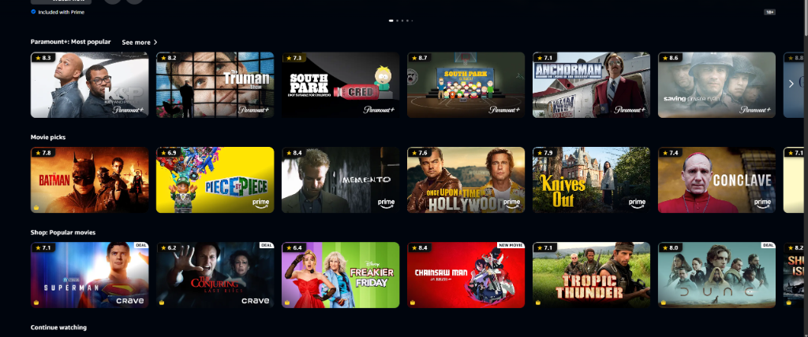
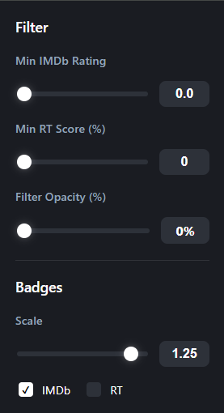

# IMDb Ratings on Prime Video

A Chrome extension that displays IMDb ratings directly on Amazon Prime Video movie thumbnails.


## Features

- ⭐ **IMDb ratings** appear on movie thumbnails while browsing
- 🚀 **Smart caching** - Cloudflare D1 database with strict caching rules
- ⏱️ **Dynamic TTL** - Fresh movies update more frequently; older movies cache for 30 days
- 🔄 **Robust Fallbacks** - Handles "Director's Cut", ampersands, and subtitle variations automatically
- 🎨 **Sleek design** - Opaque, flush-fitting badges that match Prime Video's aesthetic

## Screenshots


*IMDb ratings seamlessly integrated into Prime Video thumbnails*



*Customize rating visibility and filters*

## Installation

### From Source

1. Clone this repository
2. Deploy the Cloudflare Worker (see below)
3. Update `background.js` line 14 with your Worker URL
4. Open `chrome://extensions`
5. Enable **Developer mode**
6. Click **Load unpacked** and select the project folder

## Cloudflare Worker Setup

The extension uses a Cloudflare Worker to proxy OMDb API requests, ensuring API key security and efficient caching.

### 1. Get OMDb API Key
- **OMDb**: [omdbapi.com/apikey.aspx](https://www.omdbapi.com/apikey.aspx) (Free tier available)

### 2. Deploy Worker & Database

You need [Wrangler](https://developers.cloudflare.com/workers/wrangler/install-and-update/) installed.

```bash
# Login to Cloudflare
npx wrangler login

# Create D1 Database
npx wrangler d1 create imdb-ratings-db
# COPY THE "database_id" from the output and paste it into worker/wrangler.toml

# Initialize Schema
npx wrangler d1 execute imdb-ratings-db --remote --file=./schema.sql

# Set API Key Secret
npx wrangler secret put OMDB_API_KEY
# (Enter your OMDb key when prompted)

# Deploy Worker
cd worker
npx wrangler deploy
```

### 3. Update Extension

Edit `background.js` and replace the placeholder URL with your deployed worker URL:

```javascript
const PROXY_URL = 'https://imdb-ratings-proxy.YOUR_SUBDOMAIN.workers.dev';
```

## Project Structure

```
├── manifest.json         # Extension configuration (Manifest V3)
├── background.js         # Service worker - API routing
├── content-script.js     # Thumbnail detection & badge injection
├── styles.css            # Rating badge styling
├── icons/                # Extension icons
└── worker/
    ├── index.js          # Cloudflare Worker code (Proxy + Cache)
    ├── schema.sql        # Database schema
    └── wrangler.toml     # Worker configuration
```

## How It Works

1. **Detection**: `MutationObserver` watches for new movie cards on the Prime Video page.
2. **Batching**: Requests are batched and sent to the background script.
3. **Proxy**: The background script calls the Cloudflare Worker.
4. **Caching & Fetching**:
    - **Check Cache**: Worker checks D1 database (case-insensitive title match).
    - **API Fallback**: If not cached, fetches from OMDb.
    - **Progressive Retry**: If OMDb fails, retries with simplified titles (removing "Director's Cut", brackets, subtitles, etc.).
    - **Upsert**: Successful lookups are stored in D1 with a Time-To-Live (TTL) based on release date.

## Cache Strategy

| Movie Age | TTL |
|-----------|-----|
| ≤ 7 days | 1 hour |
| 8-14 days | 1 day |
| ≥ 15 days | 30 days |

## License

MIT
